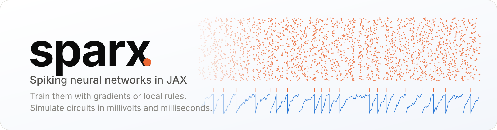
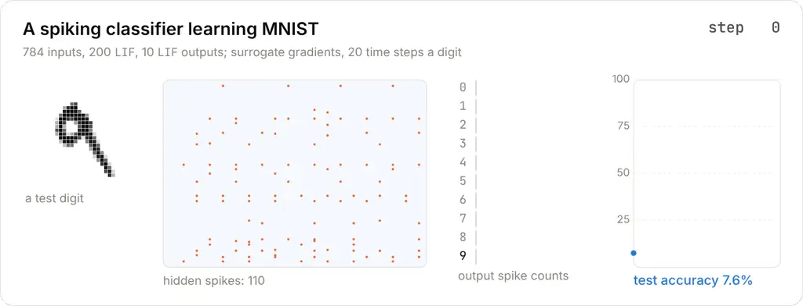
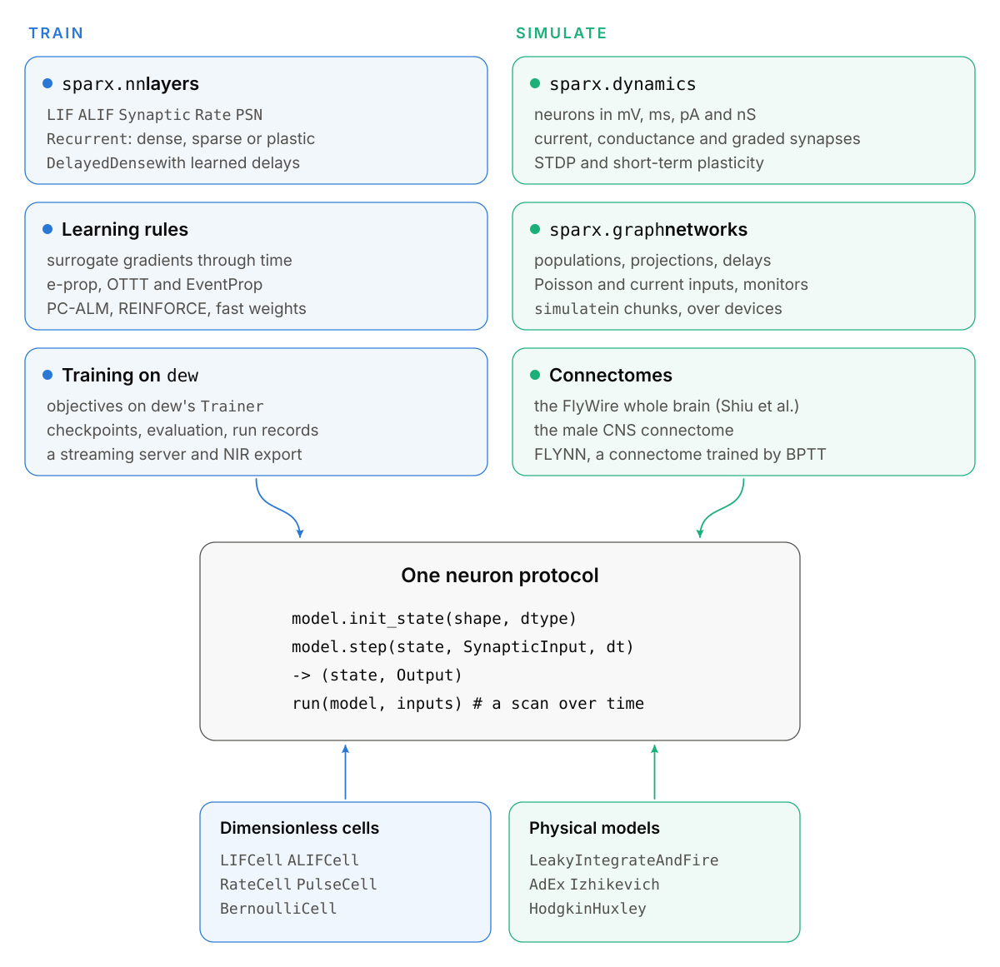
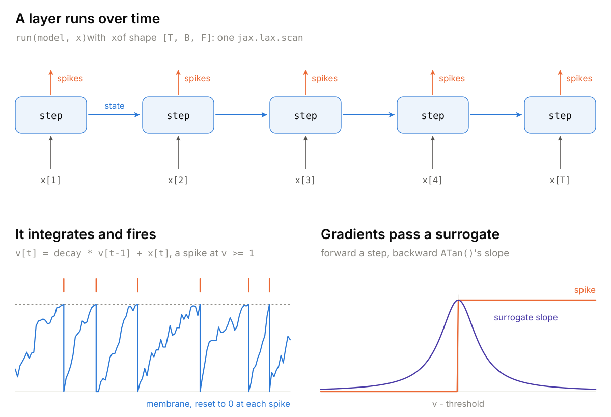
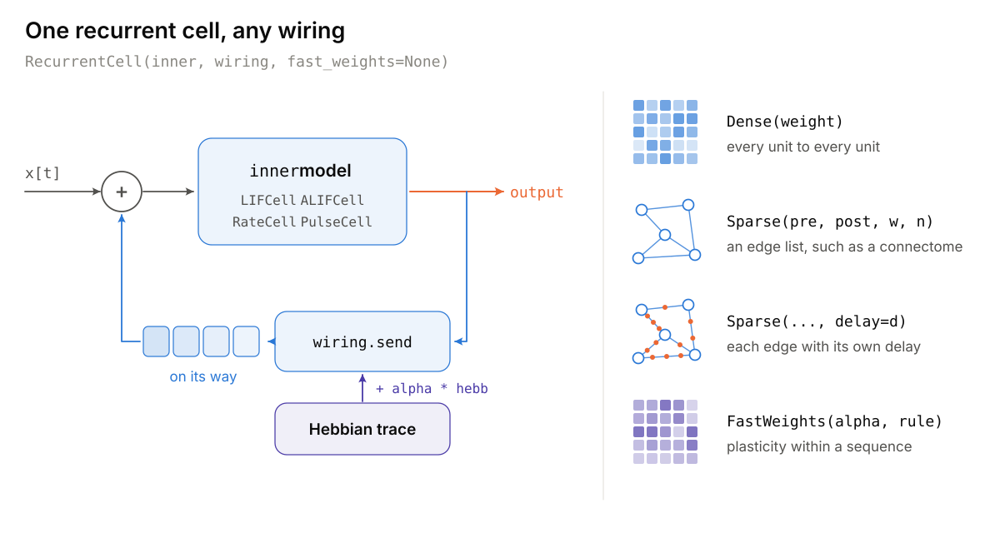
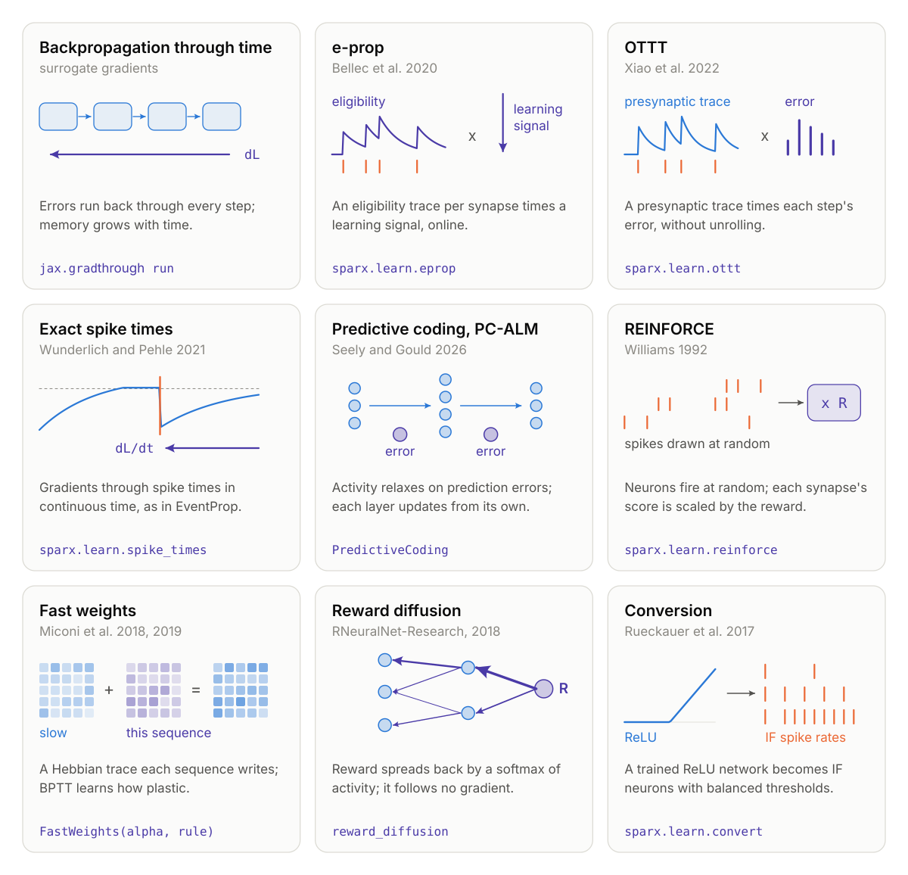
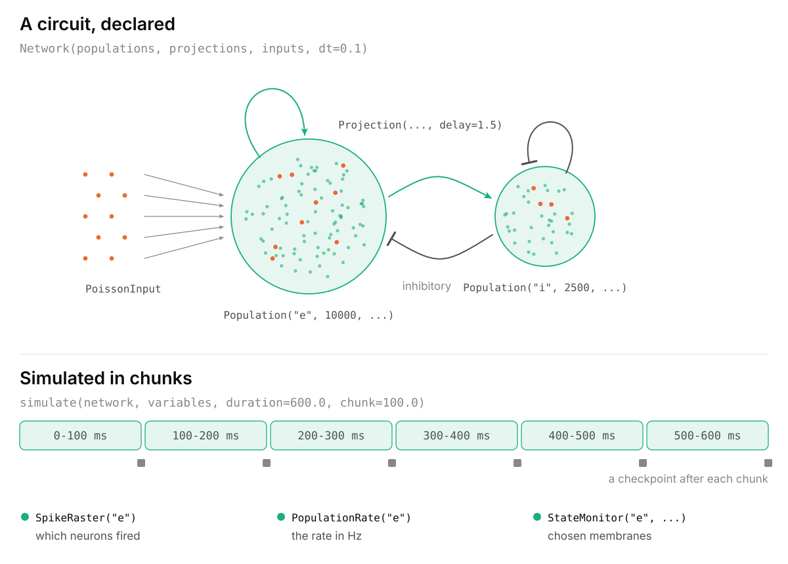
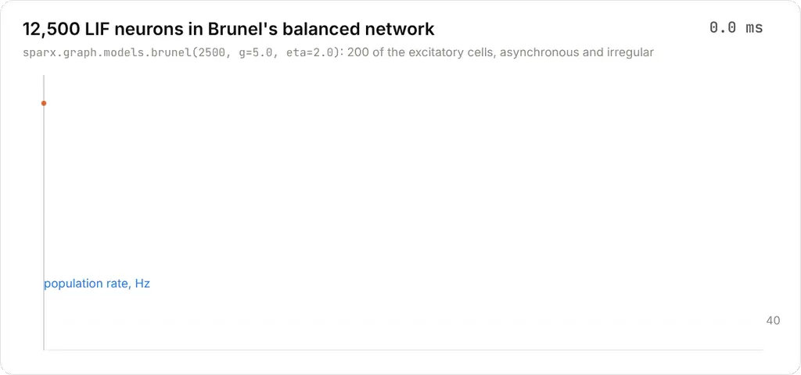
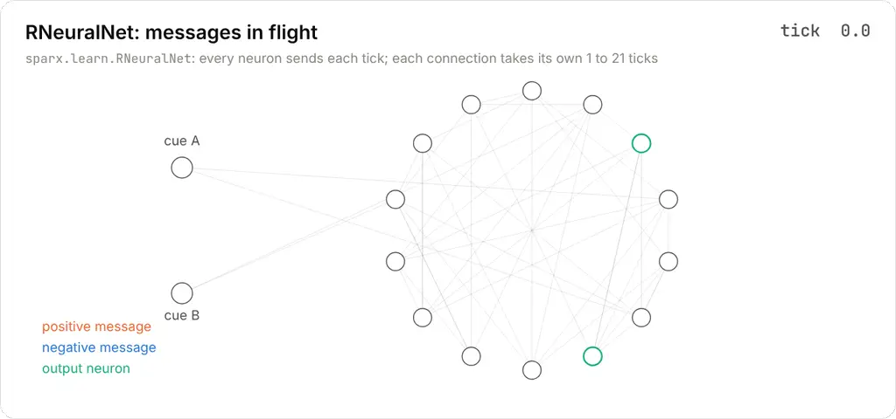
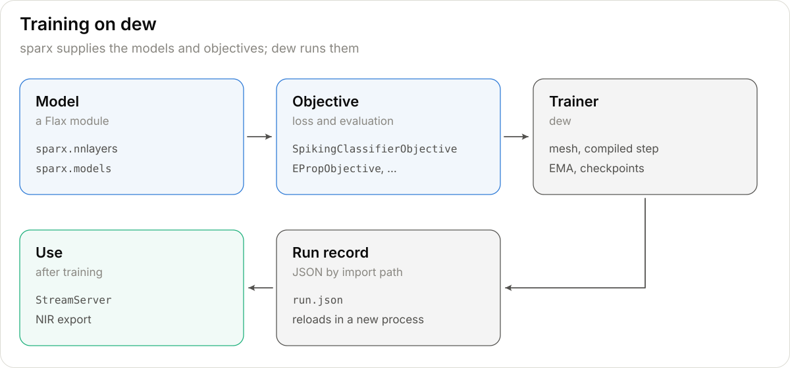

<picture>
  <source media="(prefers-color-scheme: dark)" srcset="docs/assets/banner-dark.svg">
  
</picture>

sparx trains spiking neural networks and simulates circuits of biological neurons, in JAX. Its spiking layers are Flax modules, so they train with optax or [dew](https://github.com/AshishKumar4/dew) and work with `jit`, `grad`, `vmap` and sharding. The same neuron models also run in millivolts and milliseconds, wired into circuits and whole connectomes, and there they match NEST and Brian2.

[Guide](docs/guide.md) · [Train, serve and export](docs/tutorials/train-and-deploy.md) · [From NEST and Brian2](docs/tutorials/nest-and-brian2.md) · [Fit a circuit](docs/tutorials/fit-a-circuit.md) · [Units](docs/units.md) · [Fidelity ledger](docs/fidelity.md) · [Design](docs/design.md) · [Performance](docs/performance.md)

## Install

```bash
git clone https://github.com/AshishKumar4/sparx.git && cd sparx
uv venv --python 3.12 && source .venv/bin/activate
uv pip install -e .                    # sparx and dew
uv pip install -e ".[test]" && pytest -q
```

sparx needs Python 3.12 or later and is tested with JAX 0.11.2, Flax 0.12.10 and optax 0.2.8 on CPU. For a GPU or TPU, install the matching JAX build first. The API may change before 1.0.

## A first network

```python
import flax.linen as nn
import jax
import jax.numpy as jnp
import optax

import sparx


class Net(nn.Module):
    @nn.compact
    def __call__(self, spikes):                     # [T, B, 784]
        x = sparx.nn.LIF(tau=2.0)(nn.Dense(256)(spikes))
        return sparx.nn.LI(tau=2.0)(nn.Dense(10)(x))  # membrane [T, B, 10]


net = Net()
images = jax.random.uniform(jax.random.key(0), (32, 784))  # intensities in [0, 1]
labels = jnp.zeros(32, jnp.int32)
spikes = sparx.encode.RateEncoder(steps=8)(jax.random.key(1), images)  # [8, 32, 784]
params = net.init(jax.random.key(2), spikes)


def loss(params):
    logits = jnp.mean(net.apply(params, spikes), axis=0)  # mean membrane over time
    return optax.softmax_cross_entropy_with_integer_labels(logits, labels).mean()


grads = jax.grad(loss)(params)
```

`LIF` turns input currents into spikes, exactly 0 or 1, and `LI` integrates them into a membrane, which is the readout. Everything else is Flax and optax. [`examples/train_mnist.py`](examples/train_mnist.py) trains a network like this on MNIST under dew's `Trainer`.

<picture>
  <source media="(prefers-color-scheme: dark)" srcset="docs/assets/training-dark.webp">
  
</picture>

A 784-200-10 network of LIF neurons learning MNIST by surrogate gradients. It follows one test digit through 400 training steps, showing the hidden layer's spikes, the ten output neurons' spike counts and the test accuracy, which reaches 92.8%.

## How sparx fits together

<picture>
  <source media="(prefers-color-scheme: dark)" srcset="docs/assets/architecture-dark.svg">
  
</picture>

Every neuron model implements one protocol, `init_state` and `step`, and `run` scans a model over time. Dimensionless cells serve deep learning, and physical models in mV and ms serve neuroscience. The two halves mix: a layer can hold a physical model (`nn.Dynamics(AdEx())`), and a simulated population can hold a dimensionless cell.

## A spiking layer over time

<picture>
  <source media="(prefers-color-scheme: dark)" srcset="docs/assets/over_time-dark.svg">
  
</picture>

Arrays are time-major, `[T, B, ...]`. Synaptic layers run over all steps in one matrix product, and only the neurons step through time. A spike is a step function with zero derivative almost everywhere, so the backward pass uses a surrogate's slope instead. The layers are LIF, IF, LI, current-based synaptic LIF, adaptive LIF (ALIF), rate units, parallel spiking neurons and dense layers with learned delays ([guide](docs/guide.md#neuron-layers)).

## Recurrence and fast weights

<picture>
  <source media="(prefers-color-scheme: dark)" srcset="docs/assets/recurrence-dark.svg">
  
</picture>

`RecurrentCell` feeds any model's output back through a wiring: dense, an edge list such as a connectome's, or edges with their own delays. Fast weights add a Hebbian trace that each sequence writes as it runs (Miconi et al. 2018, 2019). Against Miconi et al.'s four networks in PyTorch, activity, traces and gradients agree within 5e-14. On their pattern completion task, the plastic network gets 0.3% of the zeroed bits wrong, and the same network without fast weights 50.1%.

## Learning rules

<picture>
  <source media="(prefers-color-scheme: dark)" srcset="docs/assets/learning-dark.svg">
  
</picture>

Each rule is checked against what defines it. e-prop meets the two identities its authors verify their code with, OTTT matches their PyTorch modules, PC-ALM matches their JAX reference to 5e-14, and conversion matches their toolbox. REINFORCE is checked on enumerated trajectories, and exact spike times against finite differences. The [guide](docs/guide.md#learning-rules) describes each rule.

## Simulating circuits

<picture>
  <source media="(prefers-color-scheme: dark)" srcset="docs/assets/circuits-dark.svg">
  
</picture>

```python
import jax
from sparx.graph import PopulationRate, SpikeRaster, simulate
from sparx.graph.models import brunel

network = brunel(250, g=5.0, eta=2.0)        # 1,250 LIF neurons; brunel(2500) is the paper's 12,500
result = simulate(network, network.init(jax.random.key(0)), duration=200.0, key=jax.random.key(1),
                  monitors={"spikes": SpikeRaster("e"), "rate": PopulationRate("e")})
spikes = result.records["spikes"]             # [2000, 1000]: one row of booleans per 0.1 ms step
```

<picture>
  <source media="(prefers-color-scheme: dark)" srcset="docs/assets/network-dark.webp">
  
</picture>

Brunel's balanced network at the paper's size, 10,000 excitatory and 2,500 inhibitory LIF neurons, in its asynchronous irregular regime at 37 Hz.

The physical models match NEST 3.10 and Brian2 2.10 spike for spike where the dynamics are deterministic, and in rate, irregularity and synchrony where they are chaotic. Potjans and Diesmann's cortical microcircuit, built as its reference implementation builds it, fires spike for spike with NEST on the same network ([from NEST and Brian2](docs/tutorials/nest-and-brian2.md)). On a 4-core CPU, sparx simulates a second of Brunel's network in 9.6 s, NEST in 7.5 s and Brian2 in 11.8 s ([performance](docs/performance.md#against-nest-and-brian2)). Populations can hold graded neurons and connect through stochastic release, gap junctions and neuromodulators. Projections can carry STDP, triplet STDP, dopamine-modulated STDP and short-term plasticity ([guide](docs/guide.md#simulating-circuits)).

## Connectomes

`sparx.graph.connectome` builds Shiu et al.'s (2024) model of the whole fly brain from FlyWire. It reproduces their published runs, with a rate correlation of 0.999 and the motor neuron MN9 at 67.1 Hz against their 67.0 ± 6.6, at about 30 s per simulated second on 4 CPU cores. `FLYNN` (Wang and Chen 2026) trains a connectome as a recurrent rate network with one learned weight per synapse; against their PyTorch cell its activity and gradients agree within 1e-15.

## RNeuralNet

<picture>
  <source media="(prefers-color-scheme: dark)" srcset="docs/assets/messages-dark.webp">
  
</picture>

`sparx.learn.RNeuralNet` rebuilds RNeuralNet-Research (2018), an early project of the author's, deterministically. Graded neurons sit on a random graph, each connection delivers its messages after its own delay, and a reward spreads backward by a softmax of activity. Compiled and run in a fixed order, the original C++ and sparx agree within 7.2e-7. On a delayed cue-order task, REINFORCE through the same network learns the task on four of five seeds, and the reward-diffusion rule never changes the network's choice. AGREL's update, a signed error sent back from the chosen output through the weights, learns it on the same four seeds; the same error spread by the original's shares does not.

## Training on dew

<picture>
  <source media="(prefers-color-scheme: dark)" srcset="docs/assets/training-dark.svg">
  
</picture>

The `Trainer` from [dew](https://github.com/AshishKumar4/dew) runs sparx's objectives for classification, activity fitting, e-prop, predictive coding and RNeuralNet's rewards. A run's record names every class by import path, so `dew.pipeline("runs/shd", trust=("sparx",))` loads a trained network in a new process, and `sparx.serve.StreamServer` serves it to many streams at once. The [guide](docs/guide.md#training-on-dew) has a full SHD script.

## Results

| Task | Network | Test accuracy |
| --- | --- | --- |
| MNIST, rate-coded, 8 steps | 784-512-512 LIF | 97.5% after 2 epochs |
| SHD, Hammouamri et al.'s recipe, 20 of 150 epochs | 140-256-256 LIF with learned delays | 91.9% (their code on the same machine: 93.6%) |
| SHD, 140 channels | 140-128 ALIF, with and without learned delays | 74.6% and 64.5% |
| Fashion-MNIST, Seely and Gould's headline cell | ReLU residual MLP, depth 32 | PC-ALM 75.1%, PC 62.2%, backpropagation 77.8% |
| Pattern completion, Miconi et al.'s task | plastic recurrent network | 0.3% of bits wrong; 50.1% without fast weights |

These are short, untuned runs on a 4-core CPU. The [guide](docs/guide.md#results-in-detail) gives the commands, times and comparisons. No GPU or TPU numbers exist yet.

## Correctness

Every model is checked against a reference: a float64 loop of its equations, the original authors' code, or NEST and Brian2. [docs/fidelity.md](docs/fidelity.md) lists each model's reference, the check, the observed error and every known difference. `pytest -q` runs all of it on CPU in about 16 minutes.

[`tools/make_figures.py`](tools/make_figures.py) draws the banner and diagrams, and [`tools/make_clips.py`](tools/make_clips.py) renders the clips. The spikes in the banner and the clips come from sparx runs.

## License

MIT
